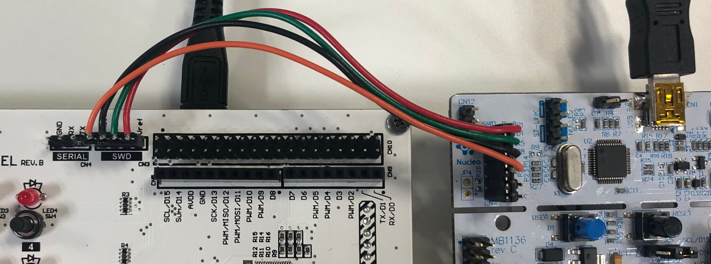

## 書き込み装置を選ぶ

NTS-1 カスタム・パネルは[マイクロ・コントローラー(STM32F030R8)](https://www.st.com/en/microcontrollers-microprocessors/stm32f030r8.html)　を使って操作子のスキャン、メイン・ボードとの通信を行っています。このマイクロ・コントローラーに書き込みするためにはSWDポート（4ピンのコネクターで配置されています）にST-LINK互換の書き込み装置を接続する必要があります。下記にいくつかの書き込み装置の例を提示します。

* Nucleo board with built-in ST-LINK: [NUCLEO-F030R8](https://www.st.com/en/evaluation-tools/nucleo-f030r8.html)
* Standalone ST-LINK: [STLINK-V3SET](https://www.st.com/en/development-tools/stlink-v3set.html)
* OEM ST-LINK compatible USB dongles: i.e: [amazon](https://www.amazon.com/dp/B01J7N3RE6/ref=cm_sw_r_tw_dp_U_x_nkh.DbGGFNB6N) 

_STMicro純正ではないOEMの書き込み装置はVrefピン（ターゲットの電圧監視をする端子）に3.3Vの出力をしているものがあります。その場合このピンはカスタム・パネルのSWD Vref端子に接続しないでください。書き込み装置が故障する原因となります。_

書き込み装置とカスタム・パネルは通常2.54mmピッチのメスーメスコネクタで接続する必要があります。書き込み装置のマニュアルを参照し、ピンの順番を間違えないよう慎重に接続を行ってください。

## 接続

ST-LINK互換のプログラマーはSWDコネクターに下記のように接続できます。



### パネル・リセットを設定する

ファームウェアの書き込みを行うとき、またカスタム・パネル単独でのデバッグを行う際、NTS-1のメイン・ボードからのリセットを止めておく必要があります。設定を行わない場合、通信のタイムアウトなどが発生する可能性があります

 _CN11_ のジャンパー・ピンを _NORMAL_ の位置にするとメイン・ボードからのリセットが動作します（通常動作）。
 
 _DEBUG_ の位置にするとメイン・ボードからリセットされなくなります。


## Arduino IDEで書き込みを行う

[Arduino IDE](https://www.arduino.cc/en/Main/Software)のboard definition パッケージが提供されており、リファレンス基板のファームウェアはArduinoのスケッチ一覧から入手、書き込みを行うことが出来ます。Board definitionはNTS-1のメイン・ボードとの基本的な通信部分を担っており、それによりユーザーは具体的なプロトタイピングに集中することができます。

### 必要なもの

下記のソフトウェアをインストールする必要があります：

* [Arduino IDE](https://www.arduino.cc/en/Main/Software)
* [STM32 Cube Programmer](https://www.st.com/en/development-tools/stm32cubeprog.html)

### Board Definitionを設定する

1.	Arduino IDEを起動し、_ファイル_ メニューで _環境設定_ を開きます
2.	_追加のボードマネージャのURL_ の編集ウインドウを開きます
3.	下記のURLをリストに加えます

```
 https://raw.githubusercontent.com/korginc/nts-1-customizations/master/Arduino/package_nts1_custom_panels_index.json
```

4.	両方のウインドウをOKを押して閉じ、 _ツール>ボード：_ メニューから _ボードマネージャ_ を開きます
5.	_NTS-1 Custom Panels_ を検索し、 version 1.0.0 をインストールします
6.	_ツール>ボード：_ メニューから _NTS-1 Custom Panels_ のグループから _NTS-1 Custom Panel rev.C_ を選択します。
7.	_ツール > Board part number:_ に表示されているのが使用する基板と一致していることを確認します。


### Serial Monitoring

一般的なUSBシリアルアダプター（STDI RS232チップ採用品）を使用することで、Arduino IDEに備えられているシリアルモニタを使うことが出来ます。[参考1](https://www.mouser.jp/ProductDetail/FTDI/LC234X?qs=sGAEpiMZZMve4%2FbfQkoj%252BI%252BbU1q%2FCxfr%2FqVjw5o%252BdnQ%3D) もしくは [参考2](https://www.amazon.com/dp/B07TXVRQ7V/ref=cm_sw_r_tw_dp_U_x_2jh.DbQX9MS4Y) のようなものがあります。

_注意: NTS-1 カスタム・パネルは5Vトレラントではありません。そのため、5V駆動のデバイスは接続しないでください。USBシリアル・アダプターは3.3V/5Vの設定ができる場合があるので、その時は3.3Vモードを使用してください。_

USBシリアルアダプターをカスタム・パネルの _SERIAL_ コネクターに接続します。


Arduino IDEのシリアルモニタを使用する場合、接続されているUSBシリアルアダプターに該当するCOMポートが設定されていることを確かめて下さい。_ツール>シリアルポート_ から設定可能です。

### スケッチ例

独自のカスタム・パネルを作成するにあたり、下記のサンプルケッチが提供されています。

* Blank Template: NTS-1 カスタム・パネルを動作させるのに最小限なコードが含まれたスケッチです。
* Sequencer Template: リファレンス・パネルのスイッチとLED, VRを利用して8ステップシーケンサーが動作するスケッチです。タイマー割り込みによりイベントがトリガーされています。

これらのスケッチは _ファイル > スケッチ例 > NTS-1_ から開くことができます。

### ベリファイとコンパイル

_検証_ ボタンを押すと、作成したスケッチを実機にアップロードすること無くコンパイルしてみることが出来ます。もしくはスケッチメニューの _検証・コンパイル_ を選んでも同じです。

コンパイルが成功するとArduino IDEのコンソールに下記のようなメッセージが表示されます。


```
 Sketch uses 10832 bytes (16%) of program storage space. Maximum is 65536 bytes.
 Global variables use 2112 bytes (25%) of dynamic memory, leaving 6080 bytes for local variables. Maximum is 8192 bytes.
```

### アップロードと実行

ここまでのステップが完了したら、Arduinoスケッチをカスタム・パネルにアップロードします。

1. _ツール>Upload Method_ をSWDに設定します。
2. _マイコンボードに書き込む_ ボタンを押します。_スケッチ_ メニューからでもアクセス可能です。

ボードへの書き込みが完了したら、Arduino IDEのコンソールに下記のようなメッセージが表示されます。

 ```
      -------------------------------------------------------------------
                       STM32CubeProgrammer v2.2.0                  
      -------------------------------------------------------------------

    ST-LINK SN  : 066AFF535550755187255039
    ST-LINK FW  : V2J34M25
    Voltage     : 3.27V
    SWD freq    : 4000 KHz
    Connect mode: Under Reset
    Reset mode  : Hardware reset
    Device ID   : 0x440
    Device name : STM32F05x/F030x8
    Flash size  : 64 KBytes
    Device type : MCU
    Device CPU  : Cortex-M0

    Memory Programming ...
    Opening and parsing file: Blank_Template.ino.bin
        File          : Blank_Template.ino.bin
        Size          : 11056 Bytes
        Address       : 0x08000000 

    Erasing memory corresponding to segment 0:
    Erasing internal memory sectors [0 10]
    Download in Progress:
  
    File download complete
    Time elapsed during download operation: 00:00:00.982
    
    RUNNING Program ... 
        Address:      : 0x8000000
    Application is running
    Start operation achieved successfully
 ```

## Other Programming Methods

It is possible to program the reference custom panel directly using the [STM32 Cube Programmer](https://www.st.com/en/development-tools/stm32cubeprog.html) software from STMicro, or any other compatible programming/on-chip debugger software (i.e.: [OpenOCD](http://openocd.org/)), however it will be necessary to install toolchains on your own and build the firmware from scratch. 

Low level information about the communication protocol with the main board will be provided at a later date. 
